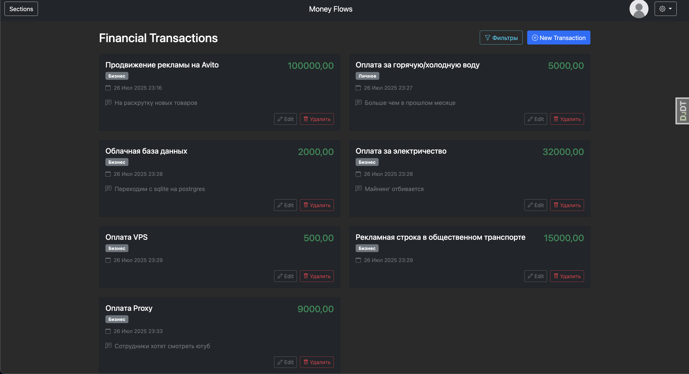
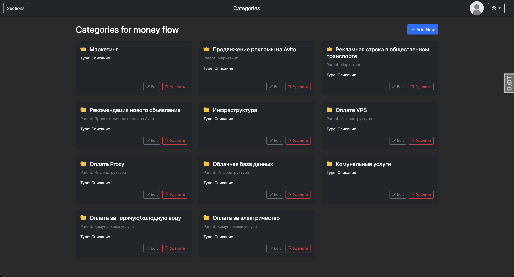

# Test task:
## Web service for managing cash flow
funds (CFD)
Description:
CFD (cash flow) is the process of accounting, management and analysis.
receipts and writing of funds of companies or individuals. Within the framework of
This task, the user must be able to keep track of all cash
operations taking into account

### examples:




## 🚀 Project Setup Guide (local)

This guide will help you set up and run the Django project using the [uv](https://docs.astral.sh/uv/getting-started/installation/) Python package manager and Docker for services like PostgreSQL.

---

### ✅ Prerequisites

- [Python](https://www.python.org/) (3.11+ recommended)
- [uv](https://docs.astral.sh/uv/getting-started/installation/)
- [Docker](https://www.docker.com/) & Docker Compose


### 1. clone repo and get dependencies
```bash
git clone https://github.com/maximSytd/django-cash-flow.git
cd django-cash-flow
uv sync
```

### 2. activate virtual environment
```bash
# Windows:
.venv/Scripts/activate

# Unix/macOS:
source .venv/bin/activate
```


### 3. Create Django secrets in .env file
Create a `.env` file in the project directory with these variables:

```bash
DEBUG=true  # Set to false for production
DJANGO_SECRET="your-django-secret-key"

# Database settings
POSTGRES_DB="yourdatabase"
POSTGRES_USER="user"
POSTGRES_PASSWORD="password"
POSTGRES_HOST="postgres"
POSTGRES_PORT=5432
```

### 4. Start Docker containers
Make sure Docker daemon is running
```bash
docker-compose up -d --build
```

### 5.1 Database migrations
```bash
python manage.py migrate
```

### 5.2. Create admin user (optional)
```bash
python manage.py createsuperuser
```

### 6. Collect static files, and compile russian transcription
```bash
python manage.py collectstatic &&
django-admin compilemessages
```

### 7. Run the application
```bash
python manage.py runserver
```
Then open http://localhost:8000 in your browser